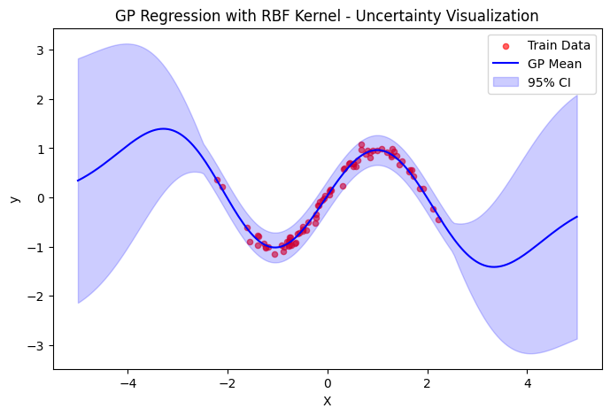

# Gaussian Process Regression with PyTorch

This repository implements Gaussian Process Regression using PyTorch with RBF kernel for uncertainty quantification in predictions.

## Requirements

- Python 3.10+
- PyTorch
- NumPy
- Matplotlib (for visualization)

## Installation

```bash
pip install torch numpy matplotlib
```

## Usage
1. Clone the repository and navigate to the project directory

2. The main components are:

    * RBFKernel: Implements the Radial Basis Function kernel
    * GaussianProcess: Main GP implementation with training and prediction capabilities

3. Run the following command to train the GP model and make predictions:

```python
import torch
import numpy as np
import random
from gpnn import GaussianProcess, RBFKernel, plot_gp_predictions

# Set seeds for reproducibility
seed = 42
random.seed(seed)
np.random.seed(seed)
torch.manual_seed(seed)

# Setup device
device = torch.device("cuda" if torch.cuda.is_available() else "cpu")

# Generate synthetic data
N = 100
X_full = torch.randn(N, 1)
y_full = torch.sin(X_full * 2.0 * np.pi / 4.0) + torch.randn(N, 1) * 0.1

# Split data
train_size = 80
X_train = X_full[:train_size]
y_train = y_full[:train_size]

# Initialize GP model
rbf_kernel = RBFKernel(length_scale=1.0, amplitude=1.0)
gp_rbf = GaussianProcess(kernel=rbf_kernel, noise_scale=0.1).to(device)

# Train the model
optimizer = torch.optim.Adam(gp_rbf.parameters(), lr=0.05)
epochs = 30

for epoch in range(epochs):
    # Perform a single optimization step.
    nll = gp_rbf.train_step(X_train, y_train, optimizer)

    # Compute train and validation MSE.
    train_pred, _ = gp_rbf.predict(X_train)
    train_mse = (train_pred - y_train).pow(2).mean().item()

    val_pred, _ = gp_rbf.predict(X_val)
    val_mse = (val_pred - y_val).pow(2).mean().item()

    if (epoch + 1) % 10 == 0:
        print(f"Epoch {epoch+1}/{epochs}, NLL = {nll:.4f}, "
                f"Train MSE = {train_mse:.4f}, Val MSE = {val_mse:.4f}")

# Evaluate on validation set.
mu_val, var_val = gp_rbf.predict(X_val)

# Predict on grid.
mu_rbf, var_rbf = gp_rbf.predict(grid)

# Plot using separate function.
plot_gp_predictions(X_train, y_train, grid, mu_rbf, var_rbf,
                    title="GP Regression with RBF Kernel - Uncertainty Visualization")

```

## Features
* RBF kernel implementation
* Automatic hyperparameter optimization
* GPU support through PyTorch
* Uncertainty quantification in predictions
* Train/validation split functionality
* Visualization of predictions with uncertainty bounds


### Model Parameters
* `length_scale`: Controls the smoothness of the function (RBF kernel parameter)
* `amplitude`: Controls the vertical scale of the function
* `noise_scale`: Observation noise parameter
* Learning rate: 0.05 (Adam optimizer)
* Training epochs: 30


### Output
The model provides:

* Mean predictions
* Variance estimates
* Training metrics (NLL, MSE)
* Visualization of predictions with uncertainty bounds

```
Epoch 10/30, NLL = -89.4995, Train MSE = 0.0072, Val MSE = 0.0097
Epoch 20/30, NLL = -105.1158, Train MSE = 0.0070, Val MSE = 0.0096
Epoch 30/30, NLL = -118.8000, Train MSE = 0.0067, Val MSE = 0.0099
```


### Visualization
The `plot_gp_predictions` function visualizes:

* Training data points
* Mean predictions
* Uncertainty bounds (±2 standard deviations)

